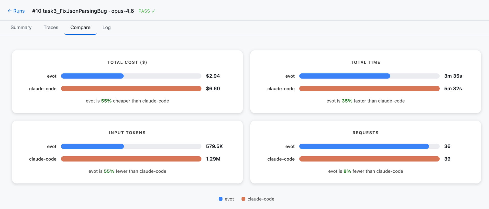

<p align="center">
  <strong>Evot</strong>
</p>

<p align="center">
  A self-evolving agent engine — fully observable, built for long-running complex work.
</p>

<p align="center">
  The engine behind <a href="https://evot.ai">evot.ai</a>
</p>

<p align="center">
  <a href="#benchmark">Benchmark</a> &middot;
  <a href="#-why-evot">Why</a> &middot;
  <a href="#installation">Install</a> &middot;
  <a href="#quickstart">Quickstart</a> &middot;
  <a href="#development">Dev</a> &middot;
  <a href="#community">Community</a>
</p>

<p align="center">
  <video src="https://github.com/user-attachments/assets/0c089005-51db-48da-977e-6339b5fb9093"></video>
</p>

## Benchmark

Same model (Claude Opus 4.6), same task, same eval environment. evot completes the work with fewer tokens, less time, and lower cost.

<p align="center">
  
</p>

> Task: Fix a real bug in serde_json ([issue #979](https://github.com/serde-rs/json/issues/979)) — investigate root cause, apply fix, write regression test, verify all tests pass.

| Metric | evot | claude-code | Difference |
|--------|------|-------------|------------|
| Cost | $2.94 | $6.60 | **55% cheaper** |
| Time | 3m 35s | 5m 32s | **35% faster** |
| Input tokens | 579K | 1.29M | **55% fewer** |
| Requests | 36 | 39 | **8% fewer** |

Both agents produce correct, passing code. The difference is in how they manage context.

### Why is evot faster and cheaper?

Most coding agents accumulate full conversation history — every tool call, every file read, every intermediate result stays in context forever. By the time the agent finishes a complex task, it's paying for hundreds of thousands of stale tokens on every request.

Evot takes a fundamentally different approach:

**Tiered context compaction.** Old tool results are progressively compressed: recent results stay full, older ones keep only metadata (file path, line count), and the oldest are cleared entirely. The model retains enough signal to avoid re-doing work, without paying for content it no longer needs.

**Microcompact between turns.** Rather than waiting for context to hit a hard limit, evot proactively clears low-value content every turn. This keeps each request small and focused — 579K total input tokens across 36 requests vs. 1.29M across 39 for claude-code.

**Progress-aware system prompt.** A lightweight task state is injected into the system prompt each turn, giving the model cross-compaction memory of what it already accomplished. This prevents the "start over" loops that plague agents after context eviction.

**Structured markers in compacted history.** When older turns are summarized, evot preserves structured metadata — which files were modified, what environment was discovered, what conclusions were reached. The model can pick up where it left off without re-reading files.

The result: evot's context stays lean throughout the session while claude-code's grows monotonically. Fewer tokens per request means faster API responses, lower cost, and less noise for the model to reason through.

## 📢 News

- **2026-05-17** [REPL] `/goal` — autonomous objectives, e.g. `/goal remove unwraps in Rust context compaction`.
- **2026-05-11** [Skills] Built-in `opencli` — control the browser, use logged-in cookies, read Feishu/Lark messages, Twitter/X timelines, and more.
- **2026-05-11** [Slim] Tool outputs now auto-compact, with token savings shown inline.
- **2026-05-08** [REPL] `/harden` — stress-test plans and git changes before shipping. Inspired by [@cjzafir](https://x.com/cjzafir/status/2052110266566107321).
- **2026-05-02** [Skills] Builtin skill support — `review` ships built-in, no install needed.
- **2026-04-28** [Image] Resize, preserve through compaction, persist to disk.
- **2026-04-23** [Search] Full-text session search — `/resume <query>` to find any past conversation.
- **2026-04-18** [REPL] `/history` + `/goto` — time-travel through conversation context.

---

## ⚡ Why Evot

Most agents dump everything into context — bloated outputs, stale history, invisible decisions. Tokens burn. Quality drifts.

Evot does the opposite:

- **Zero-waste context.** Every prompt is minimal, high-signal, rebuilt from scratch each turn.
- **Half the tokens, half the time.** Less noise → fewer turns → complex tasks done faster.
- **Self-evolving.** Full observability into every LLM call and tool execution feeds back into the engine — each prompt gets leaner automatically.
- **Everything searchable.** Full-text index over all sessions — `/resume <query>` to find any past conversation, decision, or code snippet instantly.

## Installation

### One-liner (recommended)

```bash
curl -fsSL https://evot.ai/install | sh
```

### From source

```bash
git clone https://github.com/evotai/evot.git
cd evot
make setup && make install
evot
```

## Quickstart

**1. Set your API key**

Create `~/.evotai/evot.env`:

```env
# Anthropic (default)
EVOT_LLM_ANTHROPIC_API_KEY=sk-ant-...
EVOT_LLM_ANTHROPIC_BASE_URL=your-anthropic-base-url
EVOT_LLM_ANTHROPIC_MODEL=claude-opus-4-6
# Multiple models: EVOT_LLM_ANTHROPIC_MODEL=claude-sonnet-4-6,claude-opus-4-6

# Or OpenAI
# EVOT_LLM_OPENAI_API_KEY=sk-...
# EVOT_LLM_OPENAI_BASE_URL=your-openai-base-url/v1
# EVOT_LLM_OPENAI_MODEL=gpt-5.5

# Or DeepSeek (Anthropic-compatible)
# EVOT_LLM_DEEPSEEK_API_KEY=sk-...
# EVOT_LLM_DEEPSEEK_BASE_URL=https://api.deepseek.com/anthropic
# EVOT_LLM_DEEPSEEK_PROTOCOL=anthropic
# EVOT_LLM_DEEPSEEK_MODEL=deepseek-v4-pro

# Or Xiaomi MiMo-V2.5-Pro (Anthropic-compatible)
# EVOT_LLM_XIAOMI_API_KEY=tp-...
# EVOT_LLM_XIAOMI_BASE_URL=https://token-plan-cn.xiaomimimo.com/anthropic
# EVOT_LLM_XIAOMI_PROTOCOL=anthropic
# EVOT_LLM_XIAOMI_MODEL=mimo-v2.5-pro
```

> Use `--model provider:model` for one-off overrides.

**2. Run**

```bash
evot                                          # interactive REPL
evot -p "summarize today's PRs"               # one-shot task
evot -p "review this" -f ./src/main.rs        # attach file context
evot -p "continue work" -c                   # continue latest session in cwd
evot -p "continue work" -r my-session         # resume or create session
```

<details>
<summary><b>CLI flags & options</b></summary>

| Flag | Description |
|------|-------------|
| `-p, --prompt` | Run a single prompt and exit |
| `-f, --file <path>` | Attach file/directory context |
| `-c, --continue` | Continue the latest session in the current directory |
| `-r, --resume <id>` | Resume or create a session |
| `--model <model>` | Override the configured model |
| `--verbose` | Enable info-level logging |

</details>

## Development

```bash
make setup        # install Rust toolchain, git hooks
make test         # all tests (engine + CLI)
make install      # compile standalone binary to ~/.evotai/bin/evot
```

## Community

- [**GitHub Issues**](https://github.com/evotai/evot/issues) — Bug reports / Feature
- [**Twitter @Evot_AI**](https://twitter.com/Evot_AI) — Announcements
- [**team@evot.ai**](mailto:team@evot.ai) — Reach the team directly

## License

Apache-2.0

---

<p align="center">
  Built with 🦀 + TypeScript by <a href="https://evot.ai">Evot AI</a>
</p>
