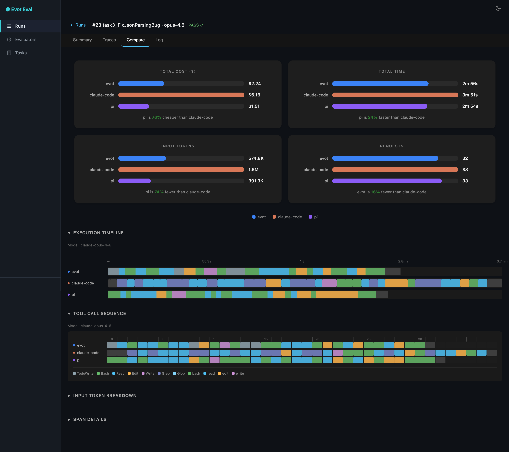
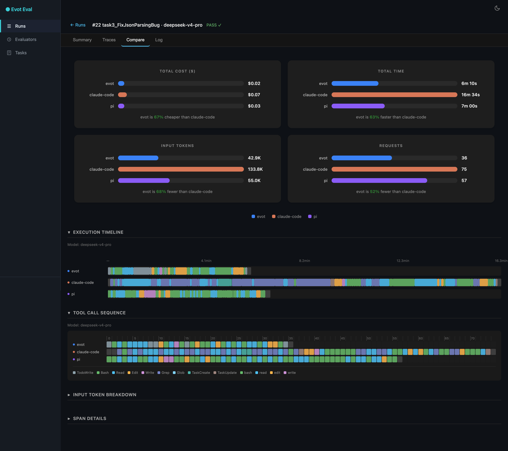
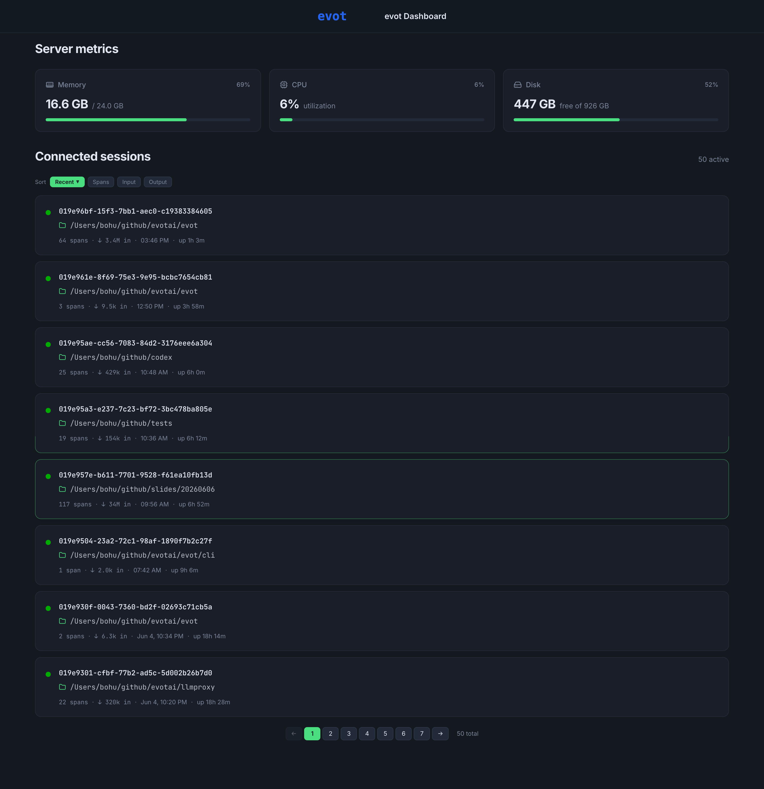
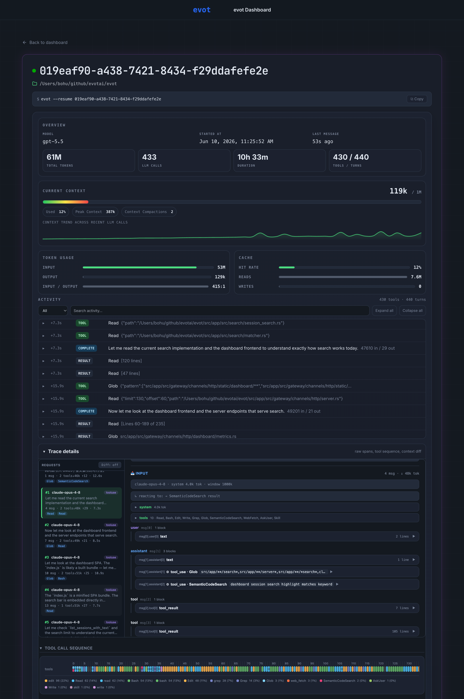

<p align="center">
  <strong>Evot</strong>
</p>

<p align="center">
  An agent engine that completes complex, long-running work with minimal tokens and maximum quality.
</p>

<p align="center">
  <em>Every gain measured under a rigorous trace + eval framework — earned through relentless iteration, never guessed at.</em>
</p>

<p align="center">
  <a href="#-news">News</a> &middot;
  <a href="#benchmark">Benchmark</a> &middot;
  <a href="#why-is-evot-faster-and-cheaper">Why</a> &middot;
  <a href="#dashboard">Dashboard</a> &middot;
  <a href="#installation">Install</a> &middot;
  <a href="#quickstart">Quickstart</a> &middot;
  <a href="#development">Dev</a>
</p>

## 📢 News

- **2026-07-03** [REPL] `/copy` — copy the last agent message's Markdown source to the clipboard.
- **2026-06-30** [Distill] `evot distill` — generate verified SFT/RL datasets by driving evot as a teacher.
- **2026-06-16** [REPL] Shift+Tab cycles reasoning effort; persisted per session.
- **2026-06-05** [Dashboard] Built-in web dashboard — server metrics, sessions, usage, and tool traces.
- **2026-05-30** [Engine] Major refactor — four-pass compaction, pi-aligned parallel tools, leaner core.

## Benchmark

Same task, same eval environment, different models. evot completes the work with fewer tokens, less time, and lower cost — on both frontier and open-source models.

<table align="center">
  <tr>
    <td align="center"><strong>Claude Opus 4.6</strong></td>
    <td align="center"><strong>DeepSeek V4 Pro</strong></td>
  </tr>
  <tr>
    <td><a href=".github/assets/benchmark-opus-4.6.png"></a></td>
    <td><a href=".github/assets/benchmark-deepseek-v4-pro.png"></a></td>
  </tr>
</table>

> Task: Fix a real bug in serde_json ([issue #979](https://github.com/serde-rs/json/issues/979)) — investigate root cause, apply fix, write regression test, verify all tests pass.

| Model | Metric | evot | claude-code | Difference |
|-------|--------|------|-------------|------------|
| Opus 4.6 | Cost | $2.24 | $6.16 | **64% cheaper** |
| Opus 4.6 | Time | 2m 56s | 3m 51s | **24% faster** |
| Opus 4.6 | Input tokens | 574.8K | 1.5M | **62% fewer** |
| DeepSeek V4 Pro | Cost | $0.02 | $0.07 | **67% cheaper** |
| DeepSeek V4 Pro | Time | 6m 10s | 16m 34s | **63% faster** |
| DeepSeek V4 Pro | Input tokens | 42.9K | 133.8K | **68% fewer** |

All agents produce correct, passing code. The difference is how they manage context.

### Why is evot faster and cheaper?

Give the LLM less context, but higher-quality context. Where other agents call the LLM to summarize when context overflows — burning extra tokens and time — evot uses **zero LLM calls for context management**:

- **Algorithmic compaction** — a four-pass Rust pipeline (Reclaim → Shrink → Collapse → Evict) runs in microseconds between turns. Images downgrade to path references; old turns collapse to one-line summaries.
- **Spill to disk** — large tool results write to disk with a short preview. The model re-reads on demand instead of carrying megabytes in context.
- **Compaction markers** — structured metadata (files modified, conclusions, environment state) survives compaction, so progress is never lost.

**Every gain is earned under a rigorous trace + eval framework, not guessed at.** Each engine change is measured against live traces and a reproducible benchmark pipeline — the same real-world tasks run against Claude Code and Codex (latest versions) — before it ships. Token usage, cost, time, and success rate must improve or hold. Relentless trial and iteration, where the numbers decide what stays. Continuous improvement, no regression.

## Dashboard

Evot ships with a built-in web dashboard for real-time observability: server resource usage, all connected sessions, and per-session detail — token usage, tool call sequences, and span-level traces.

<table align="center">
  <tr>
    <td align="center"><strong>Overview — server metrics & sessions</strong></td>
    <td align="center"><strong>Session detail — usage & tool traces</strong></td>
  </tr>
  <tr>
    <td><a href=".github/assets/dashboard-overview.png"></a></td>
    <td><a href=".github/assets/dashboard-session-detail.png"></a></td>
  </tr>
</table>

---

## Installation

### One-liner (recommended)

```bash
curl -fsSL https://evot.ai/install | sh
```

### From source

```bash
git clone https://github.com/evotai/evot.git
cd evot
make setup && make install
evot
```

## Quickstart

**1. Set your API key**

Create `~/.evotai/evot.env`:

```env
# Anthropic (default)
EVOT_LLM_ANTHROPIC_API_KEY=sk-ant-...
EVOT_LLM_ANTHROPIC_BASE_URL=your-anthropic-base-url
EVOT_LLM_ANTHROPIC_MODEL=claude-opus-4-6
# Multiple models: EVOT_LLM_ANTHROPIC_MODEL=claude-sonnet-4-6,claude-opus-4-6

# Or OpenAI
# EVOT_LLM_OPENAI_API_KEY=sk-...
# EVOT_LLM_OPENAI_BASE_URL=your-openai-base-url/v1
# EVOT_LLM_OPENAI_MODEL=gpt-5.5

# Or DeepSeek (Anthropic-compatible)
# EVOT_LLM_DEEPSEEK_API_KEY=sk-...
# EVOT_LLM_DEEPSEEK_BASE_URL=https://api.deepseek.com/anthropic
# EVOT_LLM_DEEPSEEK_PROTOCOL=anthropic
# EVOT_LLM_DEEPSEEK_MODEL=deepseek-v4-pro

# Or Xiaomi MiMo-V2.5-Pro (Anthropic-compatible)
# EVOT_LLM_XIAOMI_API_KEY=tp-...
# EVOT_LLM_XIAOMI_BASE_URL=https://token-plan-cn.xiaomimimo.com/anthropic
# EVOT_LLM_XIAOMI_PROTOCOL=anthropic
# EVOT_LLM_XIAOMI_MODEL=mimo-v2.5-pro
```

> Use `--model provider:model` for one-off overrides.

**2. Run**

```bash
evot                                          # interactive REPL
evot -p "summarize today's PRs"               # one-shot task
evot -p "review this" -f ./src/main.rs        # attach file context
evot -p "continue work" -c                    # continue latest session in cwd
evot -p "continue work" -r my-session         # resume or create session
evot distill --auto --domain "python backend" # generate an SFT/RL dataset
```

> In the REPL: `/help` lists commands, Shift+Tab cycles the reasoning effort.

<details>
<summary><b>CLI flags & options</b></summary>

| Flag | Description |
|------|-------------|
| `-p, --prompt` | Run a single prompt and exit |
| `-f, --file <path>` | Attach file/directory context (repeatable) |
| `-c, --continue` | Continue the latest session in the current directory |
| `-r, --resume <id>` | Resume or create a session |
| `--model <model>` | Override the configured model |
| `--env-file <path>` | Path to a custom `evot.env` |
| `--skills <dir>` | Add a skills directory (repeatable) |
| `--verbose` | Enable info-level logging |

</details>

## Development

```bash
make setup        # install Rust toolchain, git hooks
make test         # all tests (engine + CLI)
make install      # compile standalone binary to ~/.evotai/bin/evot
```

## License

Apache-2.0
