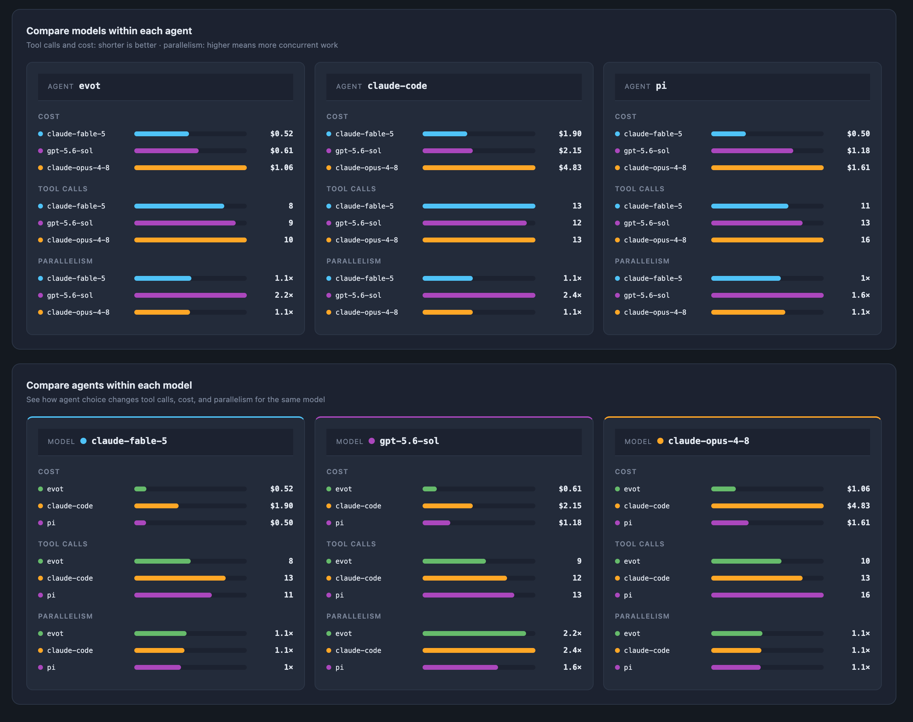
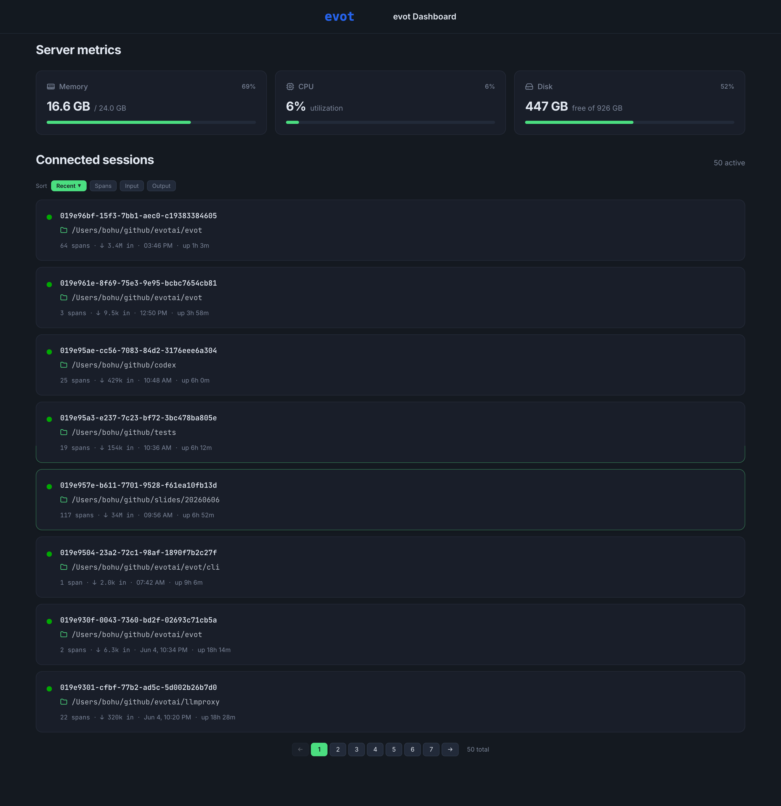
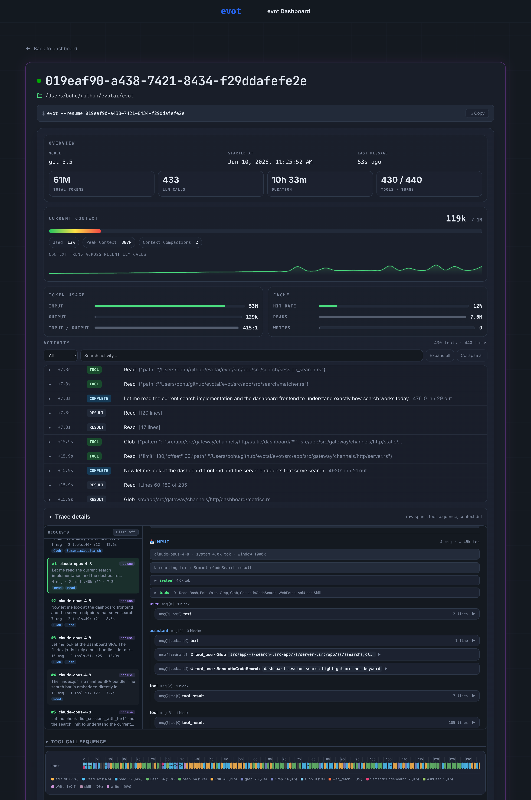

<p align="center">
  <strong>Evot</strong>
</p>

<p align="center">
  <strong>Same quality. Up to 78% less cost.</strong>
</p>

<p align="center">
  <em>Fewer tool calls. Less context waste. More work per token.</em>
</p>

<p align="center">
  <a href="#-news">News</a> &middot;
  <a href="#benchmark">Benchmark</a> &middot;
  <a href="#why-is-evot-faster-and-cheaper">Why</a> &middot;
  <a href="#dashboard">Dashboard</a> &middot;
  <a href="#installation">Install</a> &middot;
  <a href="#quickstart">Quickstart</a> &middot;
  <a href="#commands">Commands</a> &middot;
  <a href="#development">Dev</a>
</p>

## 📢 News

- **2026-07-22** [Memory] `/mem` — archive session knowledge to markdown; `/mem <terms>` and `/resume <query>` recall semantically.
- **2026-07-16** [REPL] Prompt queue — queue follow-ups and manage them with `Ctrl+B`.
- **2026-07-09** [REPL] `/log shot` — export the last assistant markdown turn as an HTML/PNG snapshot matching the TUI.
- **2026-07-03** [REPL] `/copy` — copy the last agent message's Markdown source to the clipboard.
- **2026-06-16** [REPL] Shift+Tab cycles reasoning effort; persisted per session.

## Benchmark

Same task and eval environment, across three agents and three models. The matrix shows how both choices affect cost, tool usage, and concurrent work.

<p align="center">
  <a href=".github/assets/benchmark-agent-model-comparison.png"></a>
</p>

<p align="center"><em>Cost and tool calls: lower is better. Parallelism: higher means more concurrent work.</em></p>

> Task: Fix a real bug in serde_json ([issue #979](https://github.com/serde-rs/json/issues/979)) — investigate root cause, apply fix, write regression test, verify all tests pass.

| Model | evot cost | Claude Code cost | pi cost | evot tool calls | Claude Code tool calls | pi tool calls |
|-------|----------:|-----------------:|--------:|----------------:|-----------------------:|--------------:|
| Claude Fable 5 | $0.52 | $1.90 | **$0.50** | **8** | 13 | 11 |
| GPT 5.6 | **$0.61** | $2.15 | $1.18 | **9** | 12 | 13 |
| Claude Opus 4.8 | **$1.06** | $4.83 | $1.61 | **10** | 13 | 16 |

All nine runs produce correct, passing code. Compared with Claude Code, evot costs **72–78% less** and uses **23–38% fewer tool calls**. It also uses fewer tool calls than pi on every model, while costing less on GPT 5.6 and Claude Opus 4.8.

### Why is evot faster and cheaper?

Give the LLM less context, but higher-quality context. Where other agents burn extra tokens and time managing context, evot leans on cheap, deterministic machinery first:

- **Algorithmic compaction** — a Rust pipeline runs in microseconds between turns: spent tool results are reclaimed, and old turns are evicted into a compact structured summary while recent work stays intact.
- **Provider-native compaction** — on GPT/Codex models (OpenAI Responses API), evot uses server-side compaction automatically: the endpoint returns an opaque item that replays with far higher recall than a text summary. Zero config — any failure falls back to local summarization silently.
- **Spill to disk** — large tool results write to disk with a short preview. The model re-reads on demand instead of carrying megabytes in context.
- **Compaction markers** — structured metadata (files modified, conclusions, environment state) survives compaction, so progress is never lost.

**Every gain is earned under a rigorous trace + eval framework, not guessed at.** Each engine change is measured against live traces and a reproducible benchmark pipeline — the same real-world tasks run against Claude Code and Codex (latest versions) — before it ships. Token usage, cost, time, and success rate must improve or hold. Relentless trial and iteration, where the numbers decide what stays. Continuous improvement, no regression.

## Dashboard

Evot ships with a built-in web dashboard for real-time observability: server resource usage, all connected sessions, and per-session detail — token usage, tool call sequences, and span-level traces.

<table align="center">
  <tr>
    <td align="center"><strong>Overview — server metrics & sessions</strong></td>
    <td align="center"><strong>Session detail — usage & tool traces</strong></td>
  </tr>
  <tr>
    <td><a href=".github/assets/dashboard-overview.png"></a></td>
    <td><a href=".github/assets/dashboard-session-detail.png"></a></td>
  </tr>
</table>

---

## Installation

### One-liner (recommended)

```bash
curl -fsSL https://evot.ai/install | sh
```

### From source

```bash
git clone https://github.com/evotai/evot.git
cd evot
make setup && make install
evot
```

## Quickstart

**1. Set your API key**

Create `~/.evotai/evot.env`:

```env
# Anthropic (default)
EVOT_LLM_ANTHROPIC_API_KEY=sk-ant-...
EVOT_LLM_ANTHROPIC_BASE_URL=your-anthropic-base-url
EVOT_LLM_ANTHROPIC_MODEL=claude-opus-4.8
# Multiple models: EVOT_LLM_ANTHROPIC_MODEL=claude-sonnet-5.0,claude-opus-4.8,claude-fable-5

# Or OpenAI Chat Completions
# EVOT_LLM_OPENAI_API_KEY=sk-...
# EVOT_LLM_OPENAI_BASE_URL=your-openai-compatible-base-url
# EVOT_LLM_OPENAI_MODEL=gpt-5.6-sol
# EVOT_LLM_OPENAI_PROTOCOL=openai

# Or OpenAI Responses API (official OpenAI GPT/Codex models)
# Using the official endpoint enables provider-native "remote compaction":
# context is compacted server-side with far higher recall, taking priority
# over the local algorithmic path (auto — falls back to local on any failure).
# EVOT_LLM_OPENAI_API_KEY=sk-...
# EVOT_LLM_OPENAI_MODEL=gpt-5.6-sol
# EVOT_LLM_OPENAI_PROTOCOL=openai_responses

# Or DeepSeek (Anthropic-compatible)
# EVOT_LLM_DEEPSEEK_API_KEY=sk-...
# EVOT_LLM_DEEPSEEK_BASE_URL=https://api.deepseek.com/anthropic
# EVOT_LLM_DEEPSEEK_PROTOCOL=anthropic
# EVOT_LLM_DEEPSEEK_MODEL=deepseek-v4-pro

# Or Kimi Coding (Anthropic-compatible)
# EVOT_LLM_KIMI_API_KEY=sk-...
# EVOT_LLM_KIMI_BASE_URL=https://api.kimi.com/coding
# EVOT_LLM_KIMI_PROTOCOL=anthropic
# EVOT_LLM_KIMI_MODEL=kimi-for-coding
```

**2. Run**

```bash
evot                 # interactive TUI
evot -c              # continue latest session in cwd
```

> In the TUI: `/help` lists commands, Shift+Tab cycles the reasoning effort.
>
> One-shot: `evot -p "..."` · resume by id: `evot -r <id>` · model override: `--model provider:model`

## Commands

`/help` lists everything. These are the ones unique to evot and worth knowing:

| Command | What it does |
|---------|--------------|
| `/mem` | Archive the session's knowledge to the memory vault (`~/.evotai/memory`). `/mem <terms>` searches it. Memory persists across sessions. |
| `/resume <query>` | Find and resume a past session by meaning, not just id. |
| `/harden` | Stress-test the previous plan or current changes — hunt edge cases and loopholes before you commit. |
| `/skill` | Manage skills: `list`, `install <source>`, `remove <name>`. |
| `/log shot` | Export the last assistant turn as an HTML/PNG snapshot matching the TUI. |
| `/copy` | Copy the last agent message's Markdown source to the clipboard. |

Context compaction is automatic — evot compacts between turns as context fills, with no setup. On the official OpenAI Responses API, provider-native (remote) compaction takes priority; everything else uses the local algorithmic path. Use `/compact` only when you want to force it early.

## Development

```bash
make setup        # install Rust toolchain, git hooks
make test         # all tests (engine + CLI)
make install      # compile standalone binary to ~/.evotai/bin/evot
```

## License

Apache-2.0
