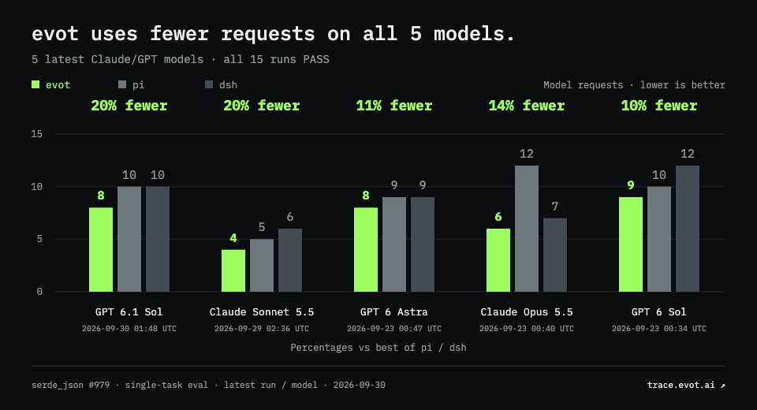

<p align="center"><strong>Evot</strong></p>
<p align="center"><strong>The lightest harness for agentic work.</strong></p>
<p align="center">An open-source terminal coding agent. A short prompt, four core tools, and the model does the thinking.</p>

<p align="center">
  <a href=".github/assets/demo.gif"></a>
</p>

## News

- **2026-09-16** `/task` — scheduled runs with push delivery.
- **2026-09-13** `/share` — read-only session links on evot.ai.
- **2026-09-02** `ctrl+b` — background a running command and keep talking.

## Quick start

```bash
curl -fsSL https://evot.ai/install | sh
evot login
```

Login opens the TUI. Use hosted models or bring your own API keys.

<details>
<summary>Build from source</summary>

```bash
git clone https://github.com/evotai/evot.git
cd evot
make setup && make install
```

</details>

<details>
<summary>Bring your own models</summary>

Configure providers in `~/.evotai/evot.env`. Examples:

```env
# Anthropic
EVOT_LLM_ANTHROPIC_API_KEY=sk-ant-...
EVOT_LLM_ANTHROPIC_BASE_URL=your-anthropic-base-url
EVOT_LLM_ANTHROPIC_MODEL=claude-opus-4.8

# OpenAI Responses API
# EVOT_LLM_OPENAI_API_KEY=sk-...
# EVOT_LLM_OPENAI_MODEL=gpt-5.6-sol
# EVOT_LLM_OPENAI_PROTOCOL=openai_responses

# DeepSeek (Anthropic-compatible)
# EVOT_LLM_DEEPSEEK_API_KEY=sk-...
# EVOT_LLM_DEEPSEEK_BASE_URL=https://api.deepseek.com/anthropic
# EVOT_LLM_DEEPSEEK_PROTOCOL=anthropic
# EVOT_LLM_DEEPSEEK_MODEL=deepseek-v4-pro

# Kimi Coding (Anthropic-compatible)
# EVOT_LLM_KIMI_API_KEY=sk-...
# EVOT_LLM_KIMI_BASE_URL=https://api.kimi.com/coding
# EVOT_LLM_KIMI_PROTOCOL=anthropic
# EVOT_LLM_KIMI_MODEL=kimi-for-coding

# OpenRouter (Anthropic-compatible)
# EVOT_LLM_OPENROUTER_API_KEY=sk-or-...
# EVOT_LLM_OPENROUTER_BASE_URL=https://openrouter.ai/api/
# EVOT_LLM_OPENROUTER_PROTOCOL=anthropic
# EVOT_LLM_OPENROUTER_MODEL=stealth/ox-alpha
```

Use comma-separated model names to configure multiple models. For OpenAI-compatible Chat Completions, set `EVOT_LLM_OPENAI_PROTOCOL=openai` and `EVOT_LLM_OPENAI_BASE_URL` to your endpoint. The official Responses API supports server-side context compaction, with local fallback.

</details>

## Less harness. More model.

- **Small by design.** ~1k prompt tokens and four core tools: `read`, `bash`, `edit`, `write`.
- **Less waiting.** Long-running commands continue in the background while the agent works on independent tasks.
- **Lean context.** [TypeSafe Jev](https://typesafe.ai) prunes obsolete tool calls and trims stale results without summarising. Compaction is a fallback.
- **Your choice of model.** Free and low-cost hosted models, or your own provider keys.

## Performance

<p align="center">
  <a href="https://trace.evot.ai/performance.html"></a>
</p>

[Live performance & comparisons →](https://trace.evot.ai/performance.html)

## License

Apache-2.0
